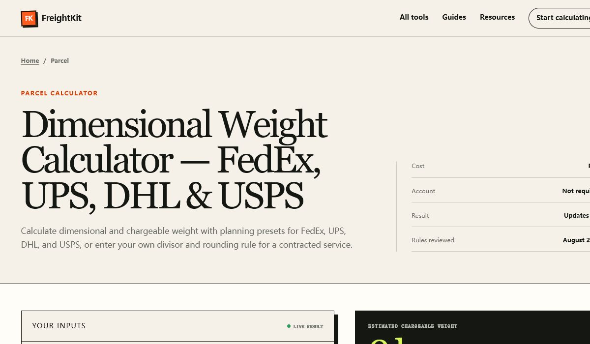

# FreightKit Calculators

Transparent JavaScript formulas and free embeds for three practical shipping calculations:

- dimensional and chargeable parcel weight;
- straight-row pallet capacity;
- ocean LCL weight-or-measure (W/M) and quote breakdown.

The live tools include visible assumptions, worked guides, and copyable results at [shipmathlab.com](https://shipmathlab.com/).

[](https://shipmathlab.com/tools/dimensional-weight-calculator)

_Live product: a responsive dimensional-weight calculator with carrier presets, transparent assumptions, and instant results._

## Use the formulas

The package has no runtime dependencies and uses standard ES modules.

```js
import { calculateDimensionalWeight } from "./src/index.js";

const result = calculateDimensionalWeight({
  length: 20,
  width: 16,
  height: 12,
  actualWeight: 24,
  divisor: 139,
  quantity: 10,
  roundingIncrement: 1,
});

console.log(result.totalChargeableWeight); // 280
```

See [FORMULAS.md](FORMULAS.md) for equations, assumptions, worked examples, and primary references.
For machine-readable discovery, [FORMULAS.json](FORMULAS.json) exposes the same three methods, canonical calculator URLs, input units, assumptions, and reference links without requiring JavaScript execution.
The [priority guide index](GUIDES.md) connects each formula to four distinct operational explanations plus three downloadable reference assets.

## Stable citation links

- Dimensional weight: <https://shipmathlab.com/topics/dimensional-weight>
- Pallet loading: <https://shipmathlab.com/topics/pallet-loading>
- LCL weight or measure: <https://shipmathlab.com/topics/lcl-weight-measure>

When citing a method, link to the matching topic reference or calculator and retain the stated assumptions. The repository also includes [CITATION.cff](CITATION.cff) for citation-aware tools.

## Embed a calculator

No JavaScript integration or account is required. Paste an iframe into an article, portal, or internal knowledge base.

```html
<iframe
  src="https://shipmathlab.com/embed/dimensional-weight-calculator"
  title="Dimensional Weight Calculator"
  width="100%"
  height="820"
  loading="lazy"
  style="border:0"
></iframe>
```

Available embed paths:

- `https://shipmathlab.com/embed/dimensional-weight-calculator`
- `https://shipmathlab.com/embed/pallet-load-calculator`
- `https://shipmathlab.com/embed/lcl-chargeable-volume-calculator`

An all-in-one example is in [examples/embed.html](examples/embed.html).
For citation wording, canonical links, and sharing guardrails, see [DISTRIBUTION.md](DISTRIBUTION.md).

## Download and cite the reference tables

- [Carrier DIM divisor reference](https://shipmathlab.com/downloads/dim-divisor-reference.csv)
- [Euro, GMA, and industrial pallet dimensions](https://shipmathlab.com/downloads/pallet-dimensions-carton-fit.csv)
- [LCL quote audit checklist and W/M example](https://shipmathlab.com/downloads/lcl-quote-audit-checklist.csv)

Each file includes a review date, scope note, and source trail. The maintenance process and release record are public at [shipmathlab.com/methodology](https://shipmathlab.com/methodology) and [shipmathlab.com/changelog](https://shipmathlab.com/changelog).

## Test

```bash
npm test
```

## Scope and safety

These functions are planning aids. Carrier contracts, tariffs, pallet ratings, packaging performance, local regulations, measurement practices, and handling constraints control real shipments. Verify critical figures with the responsible carrier, supplier, engineer, or safety owner.

## License

[MIT](LICENSE)
